# go web zero（quickly start）
感谢up软件工艺师录制的go web 入门视频
[source video](https://www.bilibili.com/video/BV1Xv411k7Xn?p=1)

以下是我跟着学习记录的笔记及各个视频对应的源代码

## p1 
一个web 打印hello, 只需两行代码!
code：
~~~go
package main

import "net/http"

func main() {
	// 调用适配器处理函数，两个参数，一个http地址，一个是hangler函数
	http.HandleFunc("/", func(w http.ResponseWriter, r *http.Request) {
		w.Write([]byte("hello go"))
	})

	//设置web 服务器,俩个参数，一个监听地址port,一个handler,默认是nil， 采用多路复用mux
	http.ListenAndServe("localhost:8080", nil)

}
~~~

浏览器运行截图

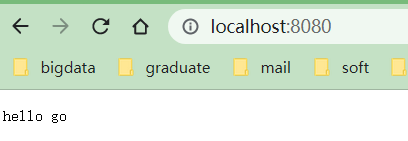

## p2 Handle 请求 上
~~~go
http.HandleFunc("/", func(w http.ResponseWriter, r *http.Request) {
w.Write([]byte("hello go"))
})
~~~
Handler 两个参数都是引用传递

Handler Handler // handler to invoke, http.DefaultServeMux if nil

指针传递：w http.ResponseWriter,
ResponseWriter是一个interface，代表了response的指针
response是一个struct，他的指针实现了各种方法
指针传递：r *http.Request

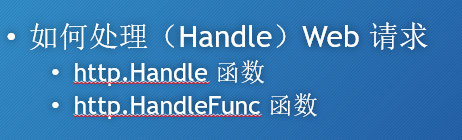

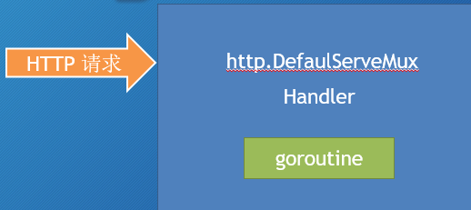

源代码：
http.Server 是一个struct

~~~
我们可以自己定义server, 可配置方法：http.Server{}
~~~go
	// 等价于上面一句话
	server := http.Server{
		Addr: ("localhost:8080"),
		Handler: nil,
	}
	server.ListenAndServe()
~~~

理解Handler

1.这是一个接口
2.里面有ServeHTTP方法, 任何东西只要有这个方法就是Handler

3.DefaultServeMux 也是一个Handler

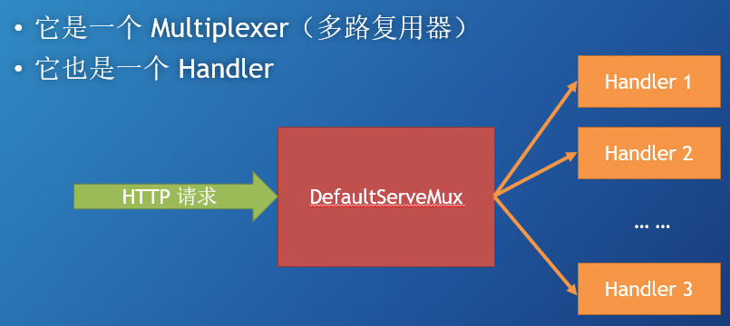

code

~~~go
package main

import "net/http"

func main() {
	mh := myHandler{} // 要使用的是这个指针

	//http.ListenAndServe("localhost:8080", nil)

	// 等价于上面一句话
	server := http.Server{
		Addr: ("localhost:8080"),
		//Handler: nil,
		Handler: &mh,
	}
	server.ListenAndServe()

}

// 自定义handler, 实现ServerHTTP 方法
type myHandler struct {
}

//ServeHTTP 不是ServerHTTP
func (m *myHandler) ServeHTTP(w http.ResponseWriter, r *http.Request) {
	w.Write([]byte("helllllllo my handler"))
}
~~~

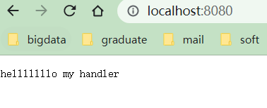

## p3 Handle 请求 下
多个Hander   

处理不同的路径/home, /about, /others

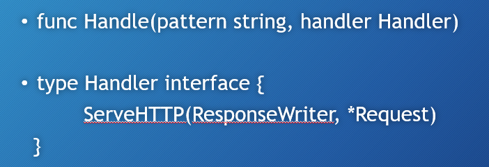
 两个参数：

	// 不同路径对应不用handler
	http.Handle("/hello", &hello)
	http.Handle("/about", &about)
	http.Handle("/home", &mh)

code
~~~go
package main

import "net/http"

func main() {
	mh := myHandler{} // 要使用的是这个指针
	about := aboutHandler{}
	hello := helloHandler{}

	//http.ListenAndServe("localhost:8080", nil)

	// 等价于上面一句话
	server := http.Server{
		Addr:    ("localhost:8080"),
		Handler: nil,
		//Handler: &mh,
	}
	// 不同路径对应不用handler
	http.Handle("/hello", &hello)
	http.Handle("/about", &about)
	http.Handle("/home", &mh)
	server.ListenAndServe()

}

// 自定义handler, 实现ServerHTTP 方法
type myHandler struct {
}

// 自定义handler, 实现ServerHTTP 方法
type helloHandler struct {
}

type aboutHandler struct {
}

//ServeHTTP 不是ServerHTTP
func (m *myHandler) ServeHTTP(w http.ResponseWriter, r *http.Request) {
	w.Write([]byte("home handler"))
}

func (m *helloHandler) ServeHTTP(w http.ResponseWriter, r *http.Request) {
	w.Write([]byte("hello handler"))
}
func (m *aboutHandler) ServeHTTP(w http.ResponseWriter, r *http.Request) {
	w.Write([]byte("about handler"))
}

~~~
不同路径对应不用handler

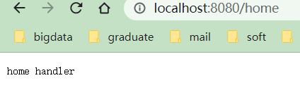

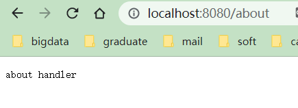

第二个函数，http.HandleFunc

code 
~~~go

package main

import "net/http"

func main() {

	server := http.Server{
		Addr:    ("localhost:8080"),
		Handler: nil,
		//Handler: &mh,
	}
	// 不同路径对应不用handler
	//http.Handle("/home", &mh)
    // 采用这个方法路由
	http.HandleFunc("/welcome", welcomeExample) // 这个不能是welcomeExample（）
	server.ListenAndServe()

}

// 自定义http.handleFunc 函数, 形参和handler函数一样
func welcomeExample(w http.ResponseWriter, r *http.Request) {
	w.Write([]byte("welcome!"))
}
~~~

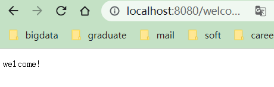

总结：两个函数：

http.Handle 第一个参数路由路径“/home”
第二个参数 Handler

http.HandleFunc 第一个参数路由路径“/home”
第二个参数 Handler **函数**（http.HandleFunc  **将Handler函数转换为Handler**）

## p4 内置的Handlers

## p6

query 操作
方法1：通过map，返回字符串切片
id := query["id"]

方法2：通过Get方法，返回key对应的第一个值
name := query.Get("name")

~~~go
package main

import (
	"log"
	"net/http"
)

func main() {
	http.HandleFunc("/home", func(w http.ResponseWriter, r *http.Request) {
		url := r.URL
		query := url.Query()

		// 方法1：通过map，返回字符串切片
		id := query["id"]
		log.Println(id)

		// 方法2：通过Get方法，返回key对应的第一个值
		name := query.Get("name")
		log.Println(name)

	})
	http.ListenAndServe("localhost:8080", nil)
}
~~~

## p7 
[source video](https://www.bilibili.com/video/BV1Xv411k7Xn?p=7)

~~~go
package main

import (
	"fmt"
	"net/http"
)

func main() {
	server := http.Server{
		Addr: "localhost:8080",
	}
	http.HandleFunc("/process", func(w http.ResponseWriter, r *http.Request) {
		r.ParseForm()
		// r.Form 出现情况，url 里面的key 和 表单里面相同的话，会一起显示出来
		fmt.Fprintln(w, r.PostForm)
	})
	server.ListenAndServe()
}
~~~
结果： 使用r.Form

结果：使用r.PostForm

index.html
~~~html
<!DOCTYPE html>
<html lang="en">
<head>
    <meta charset="UTF-8">
    <title>test Form</title>
</head>
<body>
<form action="http://localhost:8080/process?first_name=Tom" method="post" enctype="application/x-www-form-urlencoded">
    first name
    <input type="text" name="first_name" />
    last name
    <input type="text" name="last_name" />
    <input type="submit" />
</form>

</body>
</html>
~~~

## p8 上传文件
方法1

~~~go
package main

import (
	"fmt"
	"io/ioutil"
	"net/http"
)

func process(w http.ResponseWriter, r *http.Request) {
	r.ParseMultipartForm(1024)

	fileHeader := r.MultipartForm.File["uploaded"][0] // 获取上传的第一个文件
	file, err := fileHeader.Open()
	if err == nil {
		data, err := ioutil.ReadAll(file)
		if err == nil {
			fmt.Fprintln(w, string(data))
		}
	}

}
func main() {
	server := http.Server{
		Addr: "localhost:8080",
	}
	http.HandleFunc("/process", process)
	server.ListenAndServe()
}
~~~

成功读取文件

方法2

~~~go
package main

import (
	"fmt"
	"io/ioutil"
	"net/http"
)

func process(w http.ResponseWriter, r *http.Request) {
	//r.ParseMultipartForm(1024)
	//
	//fileHeader := r.MultipartForm.File["uploaded"][0] // 获取上传的第一个文件
	//file, err := fileHeader.Open()

	file, _, err := r.FormFile("uploaded") // 传入的html form里面对应的key
	// 只会返回第一个文件，适合单文件上传
	if err == nil {
		data, err := ioutil.ReadAll(file)
		if err == nil {
			fmt.Fprintln(w, string(data))
		}
	}

}
func main() {
	server := http.Server{
		Addr: "localhost:8080",
	}
	http.HandleFunc("/process", process)
	server.ListenAndServe()
}
~~~

index.html
~~~html
<!DOCTYPE html>
<html lang="en">
<head>
    <meta charset="UTF-8">
    <title>load file</title>
</head>
<body>
    <form action="http://localhost:8080/process?hello=world&thread=123" method="post" enctype="multipart/form-data">
        first name
        <input type="text" name="hello" value="gogo"/>
        last name
        <input type="text" name="post" value="zhuanma"/>
        file
        <input type="file" name="uploaded">
        <input type="submit" />
    </form>

</body>
</html>
~~~

解析JSON（视频里留坑，没有讲）

## p9 
无栗子

## p10 ResponseWriter

~~~go
package main

import "net/http"

func writeExample(w http.ResponseWriter, r *http.Request) {
	str := `<!DOCTYPE html>
<html lang="en">
<head>
    <meta charset="UTF-8">
    <title>Go web</title>
</head>
<body>
    hello go go go world
</body>
</html>`

	w.Write([]byte(str)) // 把str 写入到body 里面， 需要类型转换
}
func main() {

	server := http.Server{
		Addr: "localhost:8080",
	}
	http.HandleFunc("/write", writeExample)
	server.ListenAndServe()

}
~~~

写入结果：

写入json到web 里面

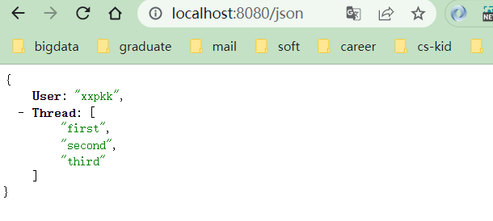

源代码：
~~~go
package main

import (
	"encoding/json"
	"net/http"
)

func writeExample(w http.ResponseWriter, r *http.Request) {
	str := `<!DOCTYPE html>
<html lang="en">
<head>
    <meta charset="UTF-8">
    <title>Go web</title>
</head>
<body>
    hello go go go world
</body>
</html>`

	w.Write([]byte(str)) // 把str 写入到body 里面， 需要类型转换
}

func headerExample(w http.ResponseWriter, r *http.Request) {
	w.Header().Set("Location", "http://baidu.com")
	// 必须调用前修改header
	w.WriteHeader(302) // 重定向302
}

type POST struct {
	User   string
	Thread []string
}

func jsonExample(w http.ResponseWriter, r *http.Request) {
	w.Header().Set("Content-Type", "application/json")
	post := &POST{
		User:   "xxpkk",
		Thread: []string{"first", "second", "third"},
	}
	json, _ := json.Marshal(post)
	w.Write(json)
}

func main() {

	server := http.Server{
		Addr: "localhost:8080",
	}
	http.HandleFunc("/write", writeExample)
	http.HandleFunc("/redirect", headerExample)

	//json 案例
	http.HandleFunc("/json", jsonExample)
	server.ListenAndServe()

}
~~~

## p11 内置的响应Response

## p12 模板 [video](https://www.bilibili.com/video/BV1Xv411k7Xn?p=12)

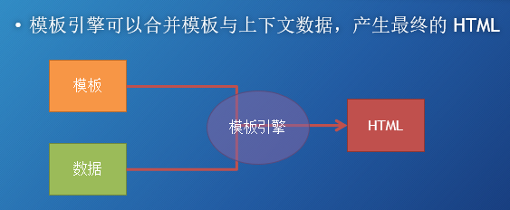

原理

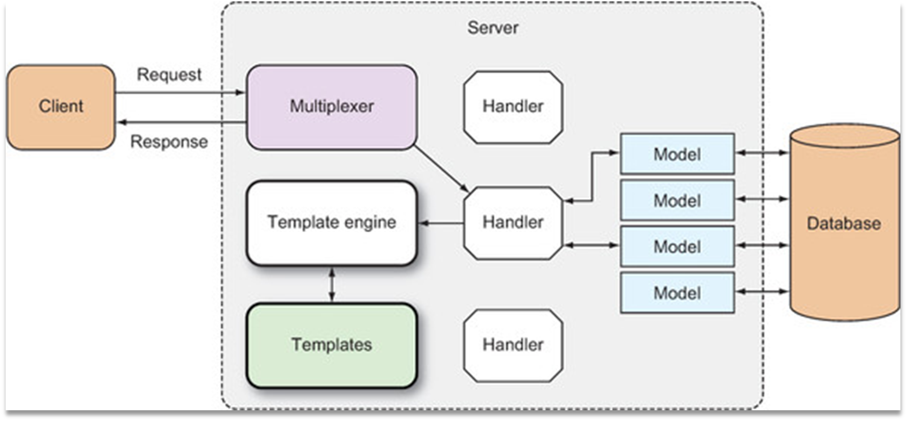

课程代码
~~~go
package main

import (
	"html/template"
	"net/http"
)

// 自定义的handler
func process(w http.ResponseWriter, r *http.Request) {
	// 解析模板文件,相对路径
	t, _ := template.ParseFiles("tmpl.html")
	// 执行模板，传入数据，替换{{.}}
	t.Execute(w, "hello go go go go")
}

func main() {
	server := http.Server{
		Addr: "localhost:8080",
	}
	http.HandleFunc("/test", process)
	server.ListenAndServe()
}
~~~

## p13

源码解读：

解析模板源（可以是字符串或模板文件），从而创建一个解析好的模板的 struct
执行解析好的模板，并传入 ResponseWriter 和 数据。
这会触发模板引擎组合解析好的模板和数据，来产生最终的 HTML，并将它传递给 ResponseWriter

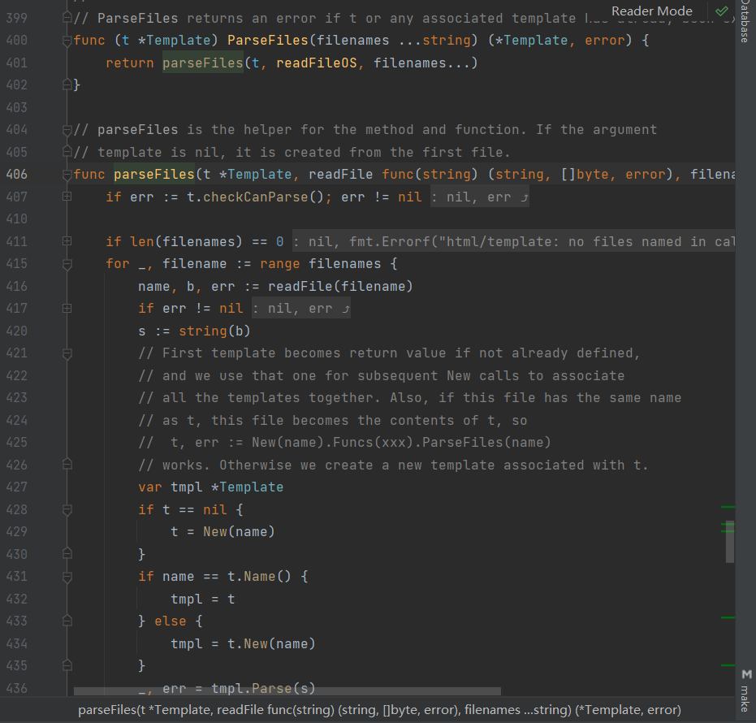

code
~~~go
package main

import (
	"html/template"
	"net/http"
)

func main() {

	server := http.Server{
		Addr: "localhost:8080",
	}
	http.HandleFunc("/process", process)
	server.ListenAndServe()

}

func process(w http.ResponseWriter, r *http.Request) {
	//解析1个模板
	t, _ := template.ParseFiles("tmpl.html")
	t.Execute(w, "hello go")
	////等价于下面两句话
	//t := template.New("tmpl.html")
	//t, _ = t.ParseFiles("tmpl.html")

	//t1，_, := template.ParseGlob("*.html")

	//解析多个模板
	ts, _ := template.ParseFiles("t1.html", "t2.html")
	ts.ExecuteTemplate(w, "t2.html", "hello go t2")

}

~~~

执行出错

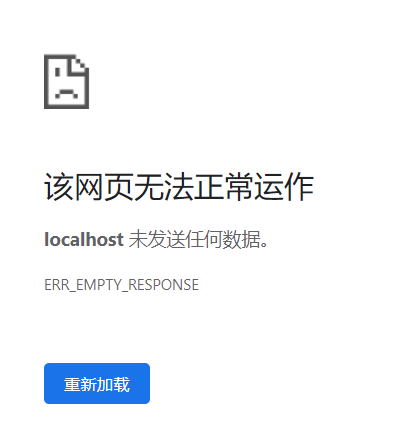

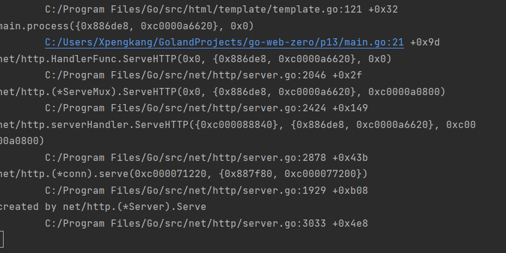

## p14 demo 模板执行与解析

## p18 链接数据库

连接到数据库

解决加载驱动问题，这里设置一下代理，就能正常下载github资源了

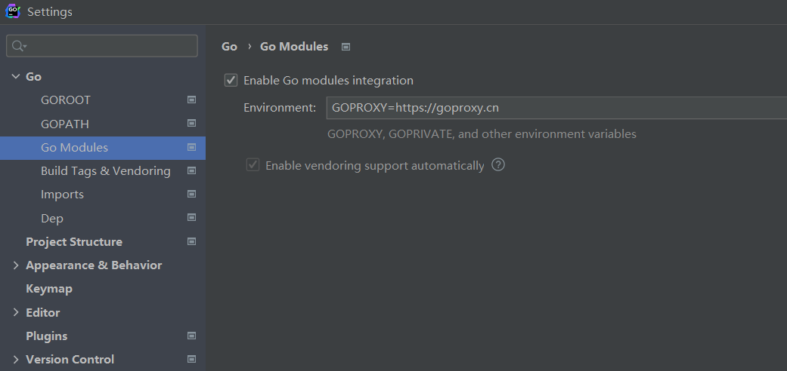

[go代理](https://cloud.tencent.com/developer/article/1773630)

func(*DB) pingContext 函数

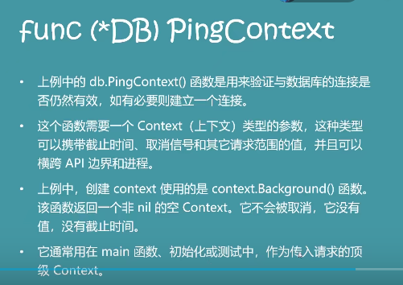

~~~go
package main

import (
	"context"
	"database/sql"
	"fmt"
	"log"
	// 数据库驱动， _ 自我注册init 会自动调用。把包变成_ , 不会直接使用。
	//没有变量，不影响代码里面的逻辑
	_ "github.com/denisenkom/go-mssqldb"
)

var db *sql.DB // 指向数据库
func main() {
	// 连接字符串
	connStr := fmt.Sprintf("server=%s;user id = %s; "+
		""+
		"password=%s;port=%d;database=%s;",
		server, user, password, port, database)
	fmt.Println(connStr)

	db, err := sql.Open("sqlserver", connStr)
	if err != nil {
		log.Fatalln(err.Error())
	}
	ctx := context.Background()

	err = db.PingContext(ctx)
	if err != nil {
		log.Fatalln(err.Error())
	}
	// 测试是否连接数据库
	fmt.Println("connected!")
}

const (
	server   = "xxxx.xxx"
	port     = 1433
	user     = "xxx"
	password = "123"
	database = "go-db"
)
~~~

## p19 数据库的查询

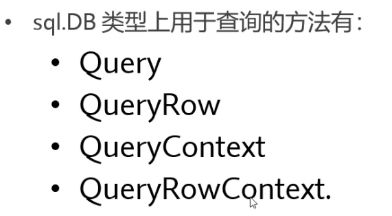

main.go
~~~go
package main

import (
	"context"
	"database/sql"
	"fmt"
	"log"
	// 数据库驱动， _ 自我注册init 会自动调用。把包变成_ , 不会直接使用。
	//没有变量，不影响代码里面的逻辑
	_ "github.com/denisenkom/go-mssqldb"
)

var db *sql.DB // 指向数据库
func main() {
	// 连接字符串
	connStr := fmt.Sprintf("server=%s;user id = %s; "+
		""+
		"password=%s;port=%d;database=%s;",
		server, user, password, port, database)
	fmt.Println(connStr)

	var err error
	// 这个db 需要是全局的，不能用:= 
	db, err = sql.Open("sqlserver", connStr)
	if err != nil {
		log.Fatalln(err.Error())
	}
	ctx := context.Background()

	err = db.PingContext(ctx)
	if err != nil {
		log.Fatalln(err.Error())
	}
	// 测试是否连接数据库
	fmt.Println("connected!")

	// 查询
	one, err := getOne(103)
	if err != nil {
		log.Fatalln(err.Error())
	}
	fmt.Println(one)
}

const (
	server   = "xxxx.xxx"
	port     = 1433
	user     = "xxx"
	password = "123"
	database = "go-db"
)
~~~

model  对应数据库的结构
~~~go
package main

// 对应数据库的结构
type app struct {
	ID     int
	name   string
	status int
	level  int
	order  int
}
~~~

service ：sql 语句
~~~go
package main

func getOne(id int) (a app, err error) {
	a = app{}

	// [order]  是sql里面的关键字，加上【】
	err = db.QueryRow("select id, name, status,"+
		"level, [order] from dbo.App").Scan(
		&a.ID, &a.name, &a.status, &a.level, &a.order)
	return
}
~~~

## p20 crud
多行查询
~~~go
// 返回的切片【】
func getMany(id int) (apps []app, err error) {

	// [order]  是sql里面的关键字，加上【】
	rows, err := db.Query("select id, name, status,"+
		"level, [order] from dbo.App where id > @id", sql.Named("Id", id))

	//对rows 遍历

	for rows.Next() {
		a := app{}
		err = rows.Scan(
			&a.ID, &a.name, &a.status, &a.level, &a.order)
		if err != nil {
			log.Fatalln(err.Error())
		}
		apps = append(apps, a)
	}
	return apps, err

}
~~~

# p21 路由

针对不同的路径，使用不同的handler

**之前的代码都在main 函数里面，不符合项目架构** 增加control 层

main()：设置类工作

controller：
    静态资源
    把不同的请求送到不同的 controller 进行处理

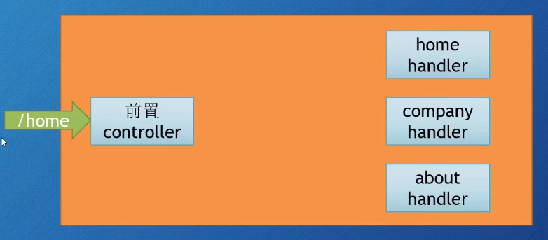

## p22

go 和json 属性映射

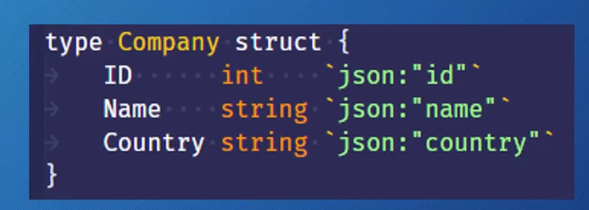

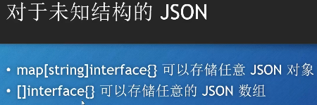

## p23 中间件

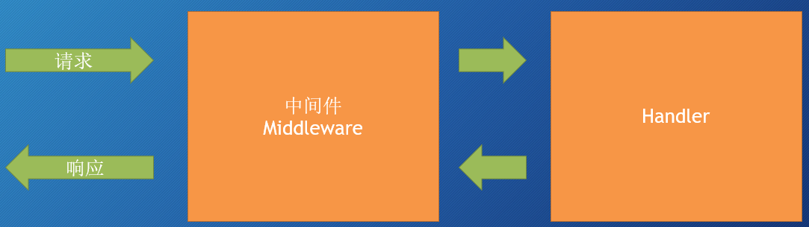

只要实现ServeHTTP 方法就可

main.go
~~~go
package main

import (
	"encoding/json"
	"go-web-zero/p23/middleware"
	"net/http"
)

type Company struct {
	ID      int
	Name    string
	Country string
}

func main() {
	http.HandleFunc("/companies", func(w http.ResponseWriter, r *http.Request) {
		c := Company{
			ID:      123,
			Name:    "gggoolle",
			Country: "USA",
		}
		enc := json.NewEncoder(w)
		enc.Encode(c)
	})
	// 使用中间件
	http.ListenAndServe("localhost:8080", new(middleware.AuthMiddleware))
}
~~~

auth.go
~~~go
package middleware

import "net/http"

// 链式结构， Next 设置为 什么，下一个handler 就是什么
// AuthMiddleware ..
type AuthMiddleware struct {
	Next http.Handler
}

func (am *AuthMiddleware) ServeHTTP(w http.ResponseWriter, r *http.Request) {
	// 如果只有一个中间件，改中间件的字段next 为nil, 交给默认路由器处理
	if am.Next == nil {

		am.Next = http.DefaultServeMux
	}
	// 判断auth
	auth := r.Header.Get("Authorization")
	if auth != "" {
		// before 路由
		am.Next.ServeHTTP(w, r)
		// after 路由
	} else {
		w.WriteHeader(http.StatusUnauthorized)
	}
}
~~~

测试：
~~~html
GET http://localhost:8080/companies HTTP/1.1

# with auth
GET http://localhost:8080/companies HTTP/1.1
Authorization: aadfsafds
~~~

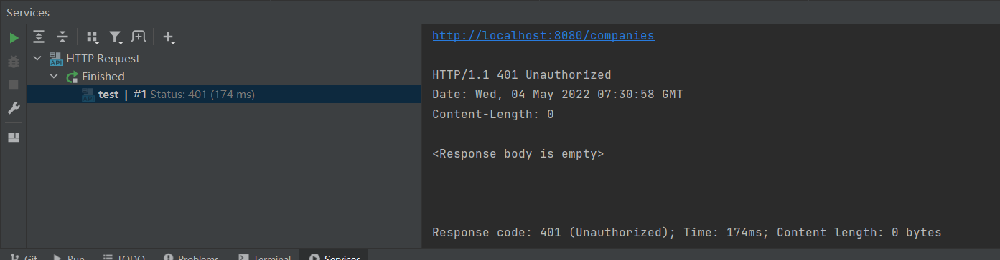

## p25 https

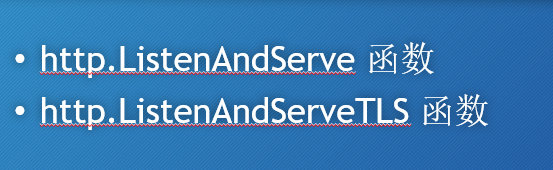
http.ListenAndServeTLS() 需要四个参数

## p27 测试

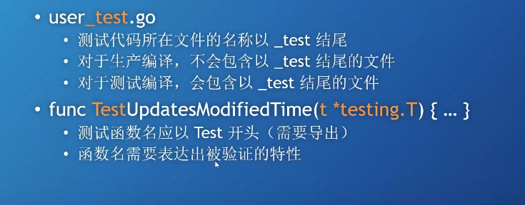

## p28 性能分析

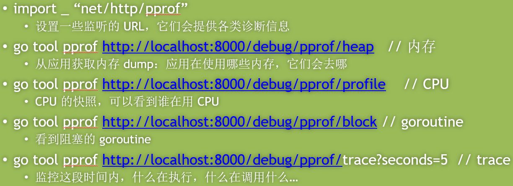

## p29 部署
Linux 部署

# p30 CRUD 栗子

# 完结撒花

都看到这里了，点个star吧:P

