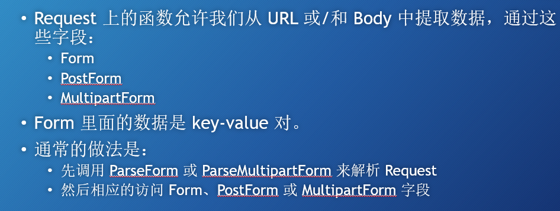
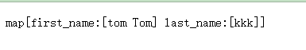
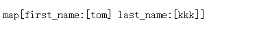
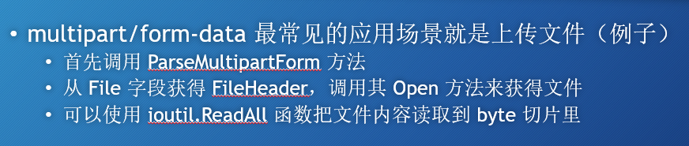
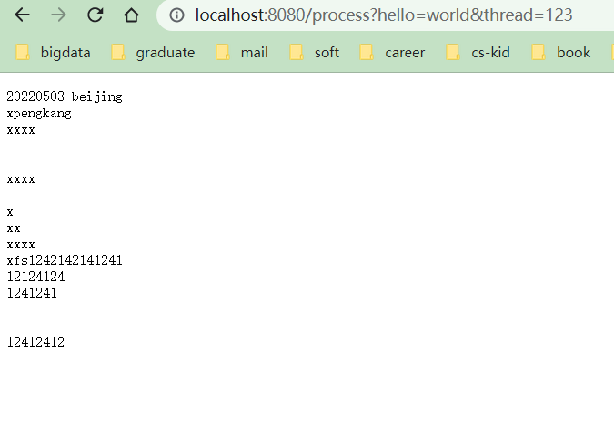
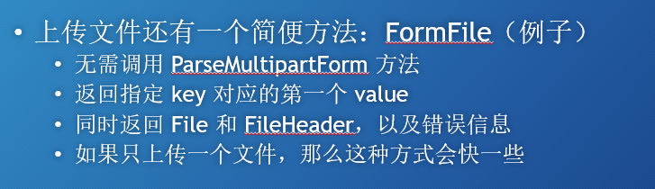
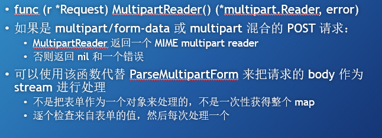
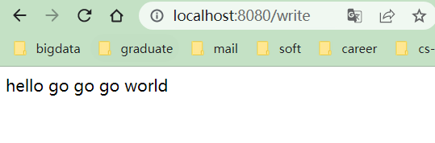

# go web zero（quickly start）
感谢up软件工艺师录制的go web 入门视频
[source video](https://www.bilibili.com/video/BV1Xv411k7Xn?p=1)

以下是我跟着学习记录的笔记及各个视频对应的源代码

Handler 两个参数都是引用传递

指针传递：w http.ResponseWriter,
ResponseWriter是一个interface，代表了response的指针
response是一个struct，他的指针实现了各种方法
指针传递：r *http.Request 

## p6

query 操作
方法1：通过map，返回字符串切片
id := query["id"]

方法2：通过Get方法，返回key对应的第一个值
name := query.Get("name")

~~~go
package main

import (
	"log"
	"net/http"
)

func main() {
	http.HandleFunc("/home", func(w http.ResponseWriter, r *http.Request) {
		url := r.URL
		query := url.Query()

		// 方法1：通过map，返回字符串切片
		id := query["id"]
		log.Println(id)

		// 方法2：通过Get方法，返回key对应的第一个值
		name := query.Get("name")
		log.Println(name)

	})
	http.ListenAndServe("localhost:8080", nil)
}
~~~

## p7 
[source video](https://www.bilibili.com/video/BV1Xv411k7Xn?p=7)

~~~go
package main

import (
	"fmt"
	"net/http"
)

func main() {
	server := http.Server{
		Addr: "localhost:8080",
	}
	http.HandleFunc("/process", func(w http.ResponseWriter, r *http.Request) {
		r.ParseForm()
		// r.Form 出现情况，url 里面的key 和 表单里面相同的话，会一起显示出来
		fmt.Fprintln(w, r.PostForm)
	})
	server.ListenAndServe()
}
~~~
结果： 使用r.Form

结果：使用r.PostForm

index.html
~~~html
<!DOCTYPE html>
<html lang="en">
<head>
    <meta charset="UTF-8">
    <title>test Form</title>
</head>
<body>
<form action="http://localhost:8080/process?first_name=Tom" method="post" enctype="application/x-www-form-urlencoded">
    first name
    <input type="text" name="first_name" />
    last name
    <input type="text" name="last_name" />
    <input type="submit" />
</form>

</body>
</html>
~~~

## p8 上传文件
方法1

~~~go
package main

import (
	"fmt"
	"io/ioutil"
	"net/http"
)

func process(w http.ResponseWriter, r *http.Request) {
	r.ParseMultipartForm(1024)

	fileHeader := r.MultipartForm.File["uploaded"][0] // 获取上传的第一个文件
	file, err := fileHeader.Open()
	if err == nil {
		data, err := ioutil.ReadAll(file)
		if err == nil {
			fmt.Fprintln(w, string(data))
		}
	}

}
func main() {
	server := http.Server{
		Addr: "localhost:8080",
	}
	http.HandleFunc("/process", process)
	server.ListenAndServe()
}
~~~

成功读取文件

方法2

~~~go
package main

import (
	"fmt"
	"io/ioutil"
	"net/http"
)

func process(w http.ResponseWriter, r *http.Request) {
	//r.ParseMultipartForm(1024)
	//
	//fileHeader := r.MultipartForm.File["uploaded"][0] // 获取上传的第一个文件
	//file, err := fileHeader.Open()

	file, _, err := r.FormFile("uploaded") // 传入的html form里面对应的key
	// 只会返回第一个文件，适合单文件上传
	if err == nil {
		data, err := ioutil.ReadAll(file)
		if err == nil {
			fmt.Fprintln(w, string(data))
		}
	}

}
func main() {
	server := http.Server{
		Addr: "localhost:8080",
	}
	http.HandleFunc("/process", process)
	server.ListenAndServe()
}
~~~

index.html
~~~html
<!DOCTYPE html>
<html lang="en">
<head>
    <meta charset="UTF-8">
    <title>load file</title>
</head>
<body>
    <form action="http://localhost:8080/process?hello=world&thread=123" method="post" enctype="multipart/form-data">
        first name
        <input type="text" name="hello" value="gogo"/>
        last name
        <input type="text" name="post" value="zhuanma"/>
        file
        <input type="file" name="uploaded">
        <input type="submit" />
    </form>

</body>
</html>
~~~

解析JSON（视频里留坑，没有讲）

## p9 
无栗子

## p10 ResponseWriter

~~~go
package main

import "net/http"

func writeExample(w http.ResponseWriter, r *http.Request) {
	str := `<!DOCTYPE html>
<html lang="en">
<head>
    <meta charset="UTF-8">
    <title>Go web</title>
</head>
<body>
    hello go go go world
</body>
</html>`

	w.Write([]byte(str)) // 把str 写入到body 里面， 需要类型转换
}
func main() {

	server := http.Server{
		Addr: "localhost:8080",
	}
	http.HandleFunc("/write", writeExample)
	server.ListenAndServe()

}
~~~

写入结果：

# 完结撒花

都看到这里了，点个star吧:P
